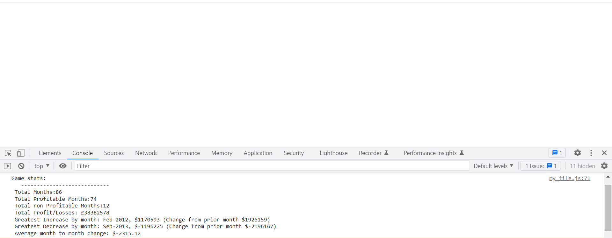

# Bootcamp Challenge 4: Console Finances

## Skills for life Bootcamp Challenge 04 (Console Finances) short description

The objective of this challenge/project is to use javascript in order to transform an array of information into relevant information (as required) and print said information to the console. This task of creating code to analyse financial records of a company is a good way to utilize and practice with recently learned skills.

### User Story

```
AS A training Developer in a financial business
I WANT to create a piece of code that will transform an array of arrays into useable information that will be printed to the console
SO THAT it can be used in order to access financials of said company
```

### Acceptance Criteria

My code must work and will utilize the "Finances" array that has been given to me. The code will:

- Analyze the records given
- Transform the records into information that is required and print it to the console

The information that is required and will be printed is as follows:

- The total number of months included in the dataset
- The net total amount of profit/losses
- The average of the changes in profit/losses
- The greatest increase in profits (date and amount)
- The greatest decrease in losses (date and amount)

### Screenshot of completed site

The following image shows the web application's console



### License

Please refer to license in the Repo

### Website Link

https://britishcryptoguy.github.io/Bootcamp-Console-Finances/
